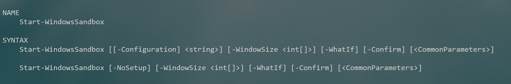

# Windows Sandbox Tools


[](https://www.powershellgallery.com/packages/WindowsSandboxTools/) [](https://www.powershellgallery.com/packages/WindowsSandboxTools/)

This repository is a collection of PowerShell tools and scripts that I use to run and configure the Windows Sandbox feature that was introduced in Windows 10 2004. Many of the commands in this repository were first demonstrated on my [blog](https://jdhitsolutions.com/blog/powershell/7621/doing-more-with-windows-sandbox/). I strongly recommend you read the blog post before trying any of the code. As I mention in the blog post, most of the code here will __reduce the security__ of the Windows Sandbox application. This is a trade-off I am willing to make for the sake of functionality that meets *my* requirements. You have to decide how much of the code you would like to use.

__*All code is offered as-is with no guarantees. Nothing in this repository should be considered production-ready or used in critical environments without your extensive testing and validation.*__

## Installing the Windows Sandbox

You need to have the 2004 version of Windows 10 or later. The Windows Sandbox will run a containerized version of your operating system. I don't know off-hand if it is supported on Windows 10 Home or Education editions. Otherwise, you should be able to run these PowerShell commands to get started:

```powershell
Get-WindowsOptionalFeature -Online -FeatureName Containers-DisposableClientVM
Enable-WindowsOptionalFeature -Online -FeatureName Containers-DisposableClientVM
```

## The WindowsSandBoxTools Module

I have created a PowerShell module called `WindowsSandBoxTools`. In this module are functions designed to make it easier to view a `wsb` configuration, create a new configuration, and export a configuration to a file. The module functions use several PowerShell class definitions.

You can read the Microsoft documentation on creating a Windows Sandbox configuration at [https://docs.microsoft.com/windows/security/threat-protection/windows-sandbox/windows-sandbox-configure-using-wsb-file](https://docs.microsoft.com/windows/security/threat-protection/windows-sandbox/windows-sandbox-configure-using-wsb-file). The module commands are designed to abstract the process of creating the XML configuration files which have a `.wsb` extension.

Install the module from the PowerShell Gallery.

```powershell
Install-Module WindowsSandboxTools
```

The module should work in Windows PowerShell and PowerShell 7 on Windows platforms.

### [Start-WindowsSandbox](docs/Start-WindowsSandbox.md)

The [`Start-WindowsSandbox`](docs/Start-WindowsSandbox.mx) function is my primary tool. It has an alias of `wsb`. You can specify the path to the wsb file.



If you use the `NoSetup` parameter, it will launch the default Windows Sandbox. In either usage, you can specify display dimensions for the sandbox. The `WindowSize` parameter expects an array of width and height, like 1024,768. My default is 1920,1080. You may have to drag the window slightly to force the sandbox to redraw the screen and remove the horizontal scrollbar. Setting the display is tricky, and I don't know if what I am using will work for everyone, so if you don't get the results you expect, please post an issue.

The sandbox will start and then minimize while any configurations you may have are executed.

### [Get-WsbConfiguration](docs/Get-WsbConfiguration.md)

If you have created custom configurations, or intend to use the samples from this module, `Get-WsbConfiguration` will display information about the configuration.

```text
PS C:\> Get-WsbConfiguration d:\wsb\simple.wsb
WARNING: No value detected for LogonCommand. This may be intentional on your part.


   Name: Simple

vGPU                 : Enable
MemoryInMB           : 8192
AudioInput           : Default
VideoInput           : Default
ClipboardRedirection : Default
PrinterRedirection   : Default
Networking           : Default
ProtectedClient      : Default
LogonCommand         :
MappedFolders        : C:\scripts -> C:\scripts [RO:False]
```

The command uses a custom format file to display the configuration. I have also found a way to insert metadata into the wsb file which (so far) doesn't appear to interfere with the Windows Sandbox application.

```text
PS C:\> Get-WsbConfiguration d:\wsb\simple.wsb -MetadataOnly

Author     Name   Description                                       Updated
------     ----   -----------                                       -------
Jeff Hicks Simple a simple configuration with mapping to C:\Scripts 12/10/2021 8:50:03 AM
```

### [New-WsbConfiguration](docs/New-WsbConfiguration.md)

This is how you can create a new Windows Sandbox configuration.

```powershell
$params = @{
 Networking = "Default"
 LogonCommand = "c:\data\demo.cmd"
 MemoryInMB = 2048
 PrinterRedirection = "Disable"
 MappedFolder = (New-WsbMappedFolder -HostFolder d:\data -SandboxFolder c:\data -ReadOnly)
 Name = "MyDemo"
 Description = "A demo WSB configuration"
}
$new = New-WsbConfiguration  @params
```

The `LogonCommand` value is relative to the WindowsSandbox. This code will create a `wsbConfiguration` object.

```text

   Name: MyDemo

vGPU                 : Default
MemoryInMB           : 2048
AudioInput           : Default
VideoInput           : Default
ClipboardRedirection : Default
PrinterRedirection   : Disable
Networking           : Default
ProtectedClient      : Default
LogonCommand         : c:\data\demo.cmd
MappedFolders        : d:\data -> c:\data [RO:True]
```

You could modify this object as necessary.

```powershell
$new.vGPU = "Enable"
$new.Metadata.Updated = Get-Date
```

The last step is to export the configuration to a `wsb` file.

```powershell
$new | Export-WsbConfiguration -Path d:\wsb\demo.wsb
```

Which will create this file:

```xml
<Configuration>
  <Metadata>
    <Name>MyDemo</Name>
    <Author>Jeff</Author>
    <Description>A demo WSB configuration</Description>
    <Updated>07/10/2022 15:40:54</Updated>
  </Metadata>
  <vGPU>Enable</vGPU>
  <MemoryInMB>2048</MemoryInMB>
  <AudioInput>Default</AudioInput>
  <VideoInput>Default</VideoInput>
  <ClipboardRedirection>Default</ClipboardRedirection>
  <PrinterRedirection>Disable</PrinterRedirection>
  <Networking>Default</Networking>
  <ProtectedClient>Default</ProtectedClient>
  <LogonCommand>
    <Command>c:\data\demo.cmd</Command>
  </LogonCommand>
  <MappedFolders>
    <MappedFolder>
      <HostFolder>d:\data</HostFolder>
      <SandboxFolder>c:\data</SandboxFolder>
      <ReadOnly>True</ReadOnly>
    </MappedFolder>
  </MappedFolders>
</Configuration>
```

I can easily launch this configuration.

```powershell
Start-WindowsSandbox -Configuration D:\wsb\demo.wsb
```

### [New-WsbMappedFolder](docs/New-WsbMappedFolder.md)

Use this command to create a mapped folder object.

```powershell
$map = New-WsbMappedFolder -HostFolder c:\work -SandboxFolder c:\work
```

Once created, you can use this in a new configuration.

```powershell
New-WsbConfiguration -Name work -MappedFolder $map -Description "Work sandbox"
```

### [Export-WSBConfiguration](docs/Export-WsbConfiguration.md)

After you have created a new configuration, you will want to save it to a file.

```powershell
New-WsbConfiguration -Name work -LogonCommand "$wsbScripts\basic.cmd" -MemoryInMB (4096*2) -MappedFolder (New-WsbMappedFolder -HostFolder d:\work -SandboxFolder c:\work) -Description "My work WSB configuration" | Export-WsbConfiguration -Path "$wsbConfigPath\work.wsb"
```

The exported file must have a `.wsb` file extension. Save the file to your `$wsbConfigPath` location.

You should get a file like this:

```xml
<Configuration>
  <Metadata>
    <Name>work</Name>
    <Author>Jeff</Author>
    <Description>My work WSB configuration</Description>
    <Updated>07/18/2022 15:43:24</Updated>
  </Metadata>
  <vGPU>Default</vGPU>
  <MemoryInMB>8192</MemoryInMB>
  <AudioInput>Default</AudioInput>
  <VideoInput>Default</VideoInput>
  <ClipboardRedirection>Default</ClipboardRedirection>
  <PrinterRedirection>Default</PrinterRedirection>
  <Networking>Default</Networking>
  <ProtectedClient>Default</ProtectedClient>
  <LogonCommand>
    <Command>C:\scripts\windowssandboxtools\wsbScripts\basic.cmd</Command>
  </LogonCommand>
  <MappedFolders>
    <MappedFolder>
      <HostFolder>c:\work</HostFolder>
      <SandboxFolder>c:\work</SandboxFolder>
      <ReadOnly>False</ReadOnly>
    </MappedFolder>
  </MappedFolders>
</Configuration>
```

## My Configuration Scripts

My default [configuration script](wsbScripts/demo-config.ps1) takes about 4 minutes to complete. I use the [BurntToast](https://github.com/Windos/BurntToast) module to show a Windows Action Center notification when it is complete.

When you import the module, it will define two global variables. `$wsbConfigPath` points to the location of your wsb files. `$wsbScripts` points to the location of your supporting scripts. By default, these variables will point to directories in the module root. You will most like want to update these variables to point to your location. I set this in my PowerShell profile script.

__You need to verify and update path references if you use any of the configurations or scripts in this module.__

## RoadMap

This is a list of items I'd like to address or handle more efficiently:

+ Look for a way to organize script components used for `LogonCommand` settings.
+ Use a default shared folder that can be a bit more generic.
+ Add a better way to provide or integrate toast notifications.
+ Create a graphical interface for creating configurations.

Feel free to post enhancment suggestions in Issues.
